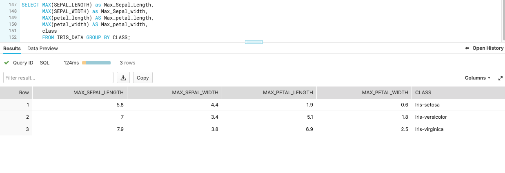

## Lab Submission

6 Pts = Screenshot of the 'CALL udf1();' executed with the result json object showing in the results.  Meaning you got the procedure to work with your iris data.

- 

2 Pts. = Screenshots showing off some sql on your table, ... for example get the counts of different names, there's like 50 each...  (Screenshot should cover the SQL and resulting table displayed)

- 

2 Pts.  = Screenshot of a more advanced use of SQL, maybe dig through the snowflake docs and see if you can get the average of each of the four numeric fields. 

Getting the averages
- 

Getting the Maximum Values
- 

## Extra Credit

5 Pts to 7 Pts = Systematically remove any unnecessary javascript in the procedure, or start fresh and look up the docs.  Basically replace the javascript so that your new procedure returns the counts or averages as mentioned above.  You basically just need the javascript statements to Store the SQL, execute it, grab the resulting rows, and stuff them in a JSON object for the return statement.  The 5 pts is for javascript since you have a working starting point.  7 if you use python.

#### Javascript Option
Displaying raw json
- 

Processed Raw json from Javascript Procedure
- 

#### Python Option
Displaying raw json
- 

Processed Raw json from Python Procedure
- 
